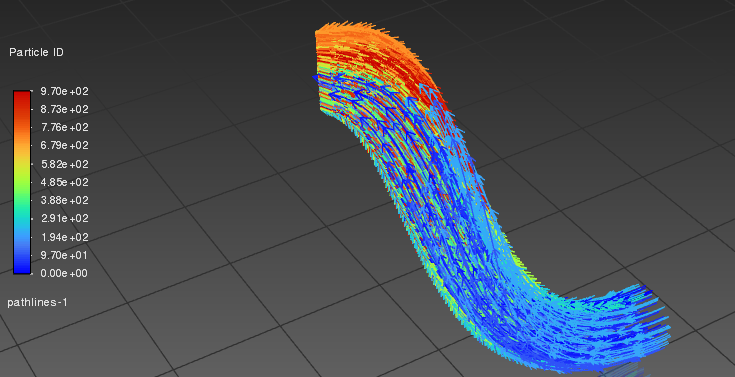
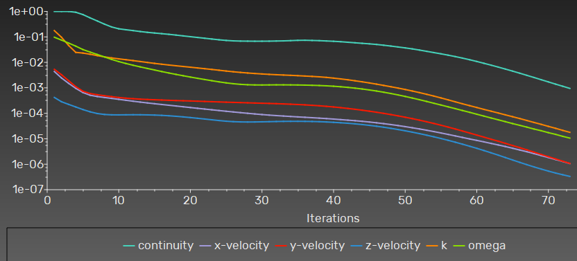

# CFD Analysis — Curved Duct Internal Flow

Internal flow simulation through a curved duct geometry using Ansys Fluent 2026 R1. This project demonstrates a full CFD workflow from CAD preparation to post-processing, capturing classical curved-pipe flow phenomena including Dean vortices, secondary flow, and centrifugal acceleration effects.

## Project Overview

A curved duct was modeled in SolidWorks, cleaned and prepared in Ansys SpaceClaim, meshed using the Fluent Watertight Workflow with polyhedral cells, and solved using the k-omega SST turbulence model.

## Workflow

1. **Geometry creation** — SolidWorks (sweep with thin wall)
2. **Geometry preparation** — Ansys SpaceClaim (Volume Extract, named selections)
3. **Meshing** — Ansys Fluent Meshing, Watertight Geometry Workflow
4. **Solver setup** — Ansys Fluent (pressure-based, steady-state)
5. **Post-processing** — Velocity contours, pressure contours, pathlines, mass flow validation

## Simulation Setup

| Parameter | Value |
|---|---|
| Solver | Pressure-based, Steady |
| Turbulence Model | k-omega SST |
| Working Fluid | Air (incompressible) |
| Inlet | Velocity-inlet, 30 m/s |
| Outlet | Pressure-outlet, 0 Pa gauge |
| Wall | No-slip |
| Mesh Type | Polyhedral with boundary layers |
| Cell Count | 5,821 |
| Min Orthogonal Quality | 0.44 |

## Key Results

| Quantity | Value |
|---|---|
| Inlet velocity (area-weighted average) | 29.67 m/s |
| Mass flow rate at inlet | 0.398 kg/s |
| Peak velocity in domain | 45.9 m/s |
| Velocity acceleration ratio | 1.5x |
| Static pressure range | -626 to +442 Pa |
| Mass conservation error | 3.4% |

## Results Gallery

### Velocity Magnitude Contour

Velocity distribution across the duct walls showing 1.5x acceleration along the outer curve due to centrifugal effects.

### Static Pressure Contour

Static pressure field showing pressure drop across the bend. Maximum pressure at inlet (442 Pa), minimum near outlet (-626 Pa).

### Flow Pathlines

Streamlines through the curved duct revealing secondary flow circulation (Dean vortices) — a classical feature of curved internal flows.

### Mass Flow Validation

Mass flow rate measured at 0.398 kg/s at inlet. Net imbalance of 3.4% indicates room for further convergence refinement.

### Residuals Plot

Solution convergence — k, omega, and velocity components reached below 1e-4. Continuity reached 1e-3 after 73 iterations.
## Engineering Observations

- **Dean vortices** clearly captured in pathline visualization, confirming secondary flow circulation typical of curved pipe geometry
- **Centrifugal effect** drives 1.5x velocity acceleration along the outer wall of the bend — consistent with published Dean flow correlations
- **Pressure differential** across the bend follows the expected adverse-pressure-gradient pattern on the inner curve and favourable on the outer curve

## Limitations and Future Work

- Mesh count is on the low side (5,821 cells); convergence residuals reached ~1e-3 for continuity
- Future runs to include mesh refinement study and Dean number sweep across multiple inlet velocities
- Boundary layer mesh inflation to be tuned for y+ in the recommended range

## Tools Used

- SolidWorks (CAD)
- Ansys SpaceClaim 2026 R1 (geometry preparation)
- Ansys Fluent Meshing 2026 R1 (Watertight Workflow)
- Ansys Fluent 2026 R1 (CFD solver)
- 

## Author

Muhammad Khizar Siddiqui 
Structural Design & CFD Engineer | Composites | Drones & Defence  
[[LinkedIn URL]](https://www.linkedin.com/in/khizar-siddiqui-962061203 )
